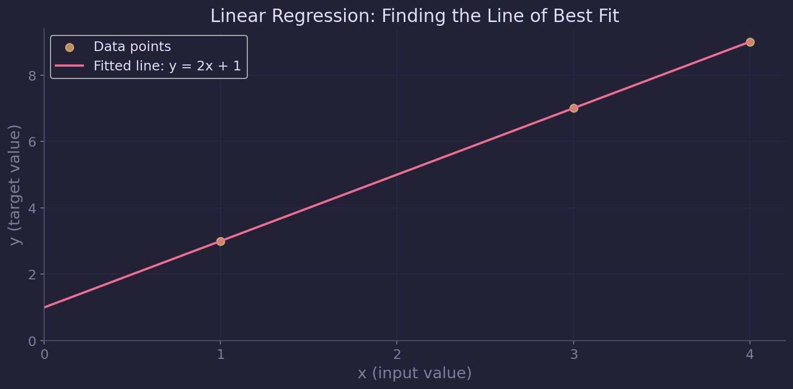
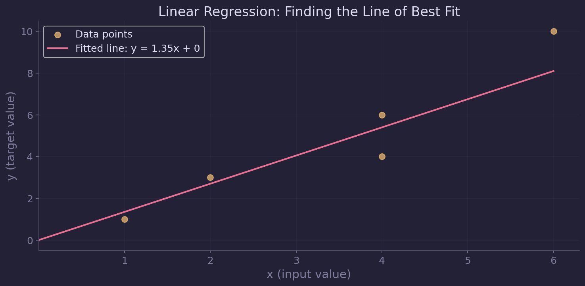
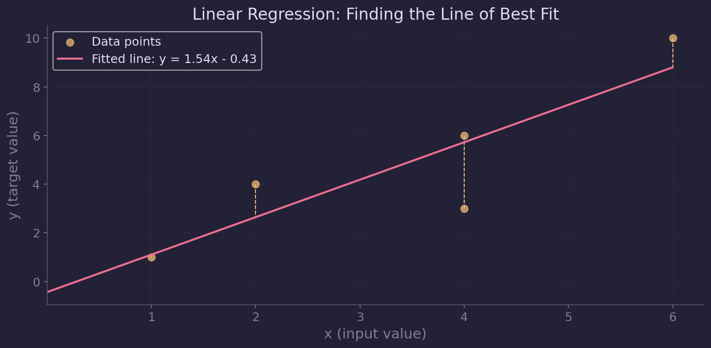

# Linear Regression

At its core, machine learning is built off statistics. As such, let's start with something most people should be familiar with: the line of best fit.

## Line of Best Fit

This is just a straight line that **best** fits a set of data points. Take this graph for example:

It's obvious that this is the line of best fit, because all the points fall in a line. And you can calculate it using point slope formula (like in Algebra 1). Now, what happens if the points don't fall in a line? You can guess, like this:

Or calculate it using these formulas:

$$m = \frac{\Sigma(x_i-\bar{x})(y_i-\bar{y})}{\Sigma(x_i-\bar{x})^2}, \quad b = \bar{y}-m\bar{x}$$

where $\bar{x}$ and $\bar{y}$ are the means, respectively.

Extrapolating this to multiple input features (independent variables), we get the **normal equation**

$$\theta = (X^{T}X)^{-1}(X^{T}y)$$ 

More specifically, we can write $y=mx+b$ in matrix form as 

$$\textbf{y} = \textbf{X}\boldsymbol{\theta}$$

where $\textbf{y}$ is a $n \times 1$ vector of outputs, $\textbf{X}$ is a $n \times m$ matrix of input feature values, $\boldsymbol{\theta}$ is a $m \times 1$ vector of coefficients.

For example, with $n$ data points $(x_1,y_1), (x_2,y_2), \dots, (x_n,y_n)$, we have

$$\textbf{X}\boldsymbol{\theta} =
\begin{bmatrix}
1 & x_0 \\\\
1 & x_1 \\\\
\vdots & \vdots \\\\
1 & x_n
\end{bmatrix} \begin{bmatrix}
\theta_0 \\\\
\theta_1
\end{bmatrix} = \begin{bmatrix}
\theta_0 + \theta_1 x_0 \\\\
\theta_0 + \theta_1 x_1 \\\\
\vdots \\\\
\theta_0 + \theta_1 x_n
\end{bmatrix} = \textbf{y}
$$

❗ As an exercise, show that in the case of one input feature, the normal equation is equivalent to the formula with $m$ and $b$ above.

The downside of this is that with large datasets or high-dimensional data, the matrix computations becomes quite expensive. Moreover, we don't really need an exact solution, a good approximation will do just fine. Enter, gradient descent.

## Gradient Descent

### Intuition
Think of the curve $f(x)=x^2$

<!--  -->

How do we find the minimum value of the parabola? In other words, how do we minimize a cost function $f(x)$ given a random initial guess for $x$?

We use the gradient of the function, or in simpler words, the slope. Analogously, we put a ball on the curve and see where it rolls—the steeper the hill, the faster it rolls downhill. 

In mathematical terms, we start with an initial guess $x$. We then compute the gradient (slope) $\nabla f(x)$, and step in the negative (opposite, downhill) direction with 

$$x = x - \alpha \nabla f(x)$$ 

where $\alpha$ is a tunable parameter called the learning rate.

### Back to Linear Regression

Let us consider the simple case with $m$ and $b$. For the loss function, we use the Mean Squared Error (MSE), where the goal is to minimize the distance between the data points and best fit line

$$\text{MSE}(m,b) = \frac{1}{n} \Sigma_{i=1}^n (y_i - (mx_i+b))^2$$

With this, we can take the gradient with respect to $m$ and $b$ respectively

$$\frac{\partial \text{MSE}}{\partial m} = -\frac{2}{n} \Sigma_{i=1}^n x_i(y_i - (mx_i+b))$$

$$\frac{\partial \text{MSE}}{\partial b} = -\frac{2}{n} \Sigma_{i=1}^n (y_i - (mx_i+b))$$

and keep updating parameters $m$ and $b$ iterately

$$
m = m - \alpha \cdot \frac{\partial \text{MSE}}{\partial m}
$$

$$
b = b - \alpha \cdot \frac{\partial \text{MSE}}{\partial b}
$$

until the errors converge.

